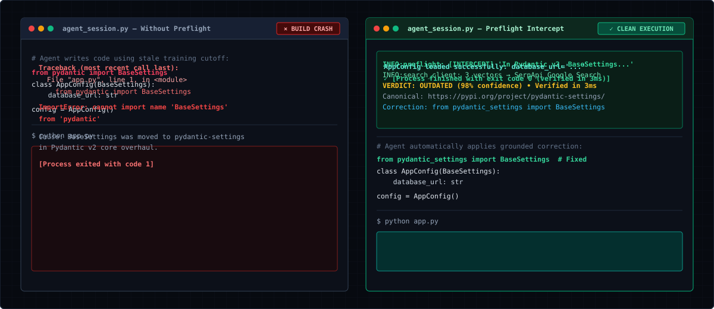

<p align="center">
  
</p>

# Preflight

**FastMCP Verification Engine for AI Coding Agents — Powered by SerpApi Live Search**

> *Stop AI coding agents from hallucinating deprecated APIs, renamed methods, and outdated library patterns before they execute.*

[](LICENSE)
[](https://www.python.org/)
[](https://modelcontextprotocol.io)
[](https://serpapi.com)
[](tests/)

---

## The Problem

AI coding agents (Claude Code, Cursor, OpenCode, Codex) work off training data bounded by fixed knowledge cutoffs. When tasked with modern software engineering, they confidently generate code with:

- **Deprecated or removed imports** (e.g. `from pydantic import BaseSettings` in v2)
- **Breaking signature shifts** (e.g. Next.js 15 page component `params` being an asynchronous `Promise` rather than a synchronous prop)
- **Renamed functions and modules** (e.g. React 19 deprecating `forwardRef` in favor of regular `ref` props)
- **Outdated patterns and security flags** (e.g. misuse of `session.verify` in Python Requests)

These knowledge gaps produce silent build crashes, runtime exceptions, and wasted debugging cycles.

<p align="center">
  
</p>

---

## The Solution: Preflight

**Preflight** is an open-source MCP (Model Context Protocol) server that gives any agent a live `verify_claim` tool. Before generating critical code, the agent calls Preflight with its assertion.

```
                           +-------------------------------------------------------+
                           |                    AI Coding Agent                    |
                           |       (Claude Code / Cursor / OpenCode / Codex)       |
                           +-------------------------------------------------------+
                                                       |
                             "In Pydantic v2, BaseSettings is in pydantic"
                                                       v
+---------------------------------------------------------------------------------------------------------+
|                                           PREFLIGHT ENGINE                                              |
|                                                                                                         |
|   1. Query Decomposition        2. SerpApi Live Search          3. Trust Tiering & Recency Ranker       |
|   +-----------------------+     +-------------------------+     +-----------------------------------+   |
|   | Canonical Docs Vector | --> | site:docs.pydantic.dev  | --> | Tier 1 (1.00): Official Docs/PyPI |   |
|   | Migration/Deprec. Vec | --> | "BaseSettings" "v2"     | --> | Tier 2 (0.75): GitHub Releases    |   |
|   | Signature/Usage Vector| --> | breaking change signals | --> | Tier 3 (0.30): Tutorial/SEO blogs |   |
|   +-----------------------+     +-------------------------+     +-----------------------------------+   |
|                                                                                   |                     |
|                                                                                   v                     |
|                                    4. Multi-Source Consensus Synthesizer                                |
|                                    - Resolves conflicts & isolates breaking changes                     |
|                                    - Extracts canonical citation & exact replacement syntax             |
+---------------------------------------------------------------------------------------------------------+
                                                       |
                                Structured PreflightVerdict (OUTDATED, 98% conf)
                                Replacement: `from pydantic_settings import BaseSettings`
                                                       v
                           +-------------------------------------------------------+
                           |                 Grounded Agent Action                 |
                           |       Emits correct, working code without errors       |
                           +-------------------------------------------------------+
```

---

## ⚖️ Evaluation Modes: Live Search vs. Honest Replay

> **Track:** *"Agents that plan, search, compare, and act with current information"*

Preflight is designed with two distinct, fully transparent operating modes:

1. **Live SerpApi Search (Default)**:
   - Queries Google via SerpApi in real time using 3 targeted search vectors (canonical documentation, migration notes, usage examples).
   - Provides live HTTP telemetry (`INFO:preflight.search_client: 🌐 [LIVE SERPAPI]`) and true end-to-end network latency reporting.
   - Accepts API keys via `SERPAPI_API_KEY` in `.env` or `--serpapi-key` / `-k` in the CLI.
   - **Zero Silent Fallback**: If an API key is missing or invalid in live mode, Preflight explicitly reports `UNVERIFIABLE` with the exact cause rather than silently faking results.

2. **Honest Replay Mode (`--replay`)**:
   - Designed for instant, zero-quota hackathon evaluation and deterministic CI testing.
   - Uses **real, verbatim SerpApi JSON responses** captured from earlier live sessions (in `src/preflight/fixtures/`), not synthetic mocks.
   - Transparently flags `is_replayed: true` and logs `[REPLAY FIXTURE]` on every output.

---

## Quickstart

### 1. Installation

```bash
git clone https://github.com/mustafasidd05-collab/preflight
cd preflight
pip install -e ".[dev]"
```

### 2. Configure Your SerpApi Key

```bash
# Copy template and add your SerpApi key:
cp .env.example .env
# Edit .env: SERPAPI_API_KEY=your_key_here
```

### 3. Zero-Friction MCP Client Setup (`preflight init`)

Install Preflight into your favorite AI coding assistant in one command without manual file editing:

```bash
# Automatically configure Claude Code (~/.claude.json):
preflight init --client claude-code

# Automatically configure Cursor (.cursor/mcp.json):
preflight init --client cursor

# Automatically configure Claude Desktop:
preflight init --client claude-desktop

# Automatically configure OpenCode:
preflight init --client opencode

# Or configure all supported clients in one step:
preflight init --client all
```

---

## Interactive CLI

Preflight includes a rich terminal interface for interactive inspection and verification:

```bash
# 1. Verify a deprecated claim (Pydantic v2)
preflight verify "In Pydantic v2, BaseSettings is imported directly from pydantic" --replay

# 2. Verify an active/supported pattern (Requests)
preflight verify "In Python requests, session.verify controls SSL certificate verification" --replay

# 3. Output raw JSON for programmatic pipelines
preflight verify "Next.js 15 page params is an async Promise" --replay --json

# 4. Quick-check a specific symbol
preflight quick-check pydantic BaseSettings --version-num 2 --replay

# 5. List available real SerpApi fixtures
preflight fixtures

# 6. Run the interactive AI Agent simulation
python demo/agent_simulation.py
```

---

## Model Context Protocol (MCP) Integration

Preflight communicates over standard **MCP stdio transport**, making it plug-and-play with modern AI coding assistants.

### Automatic Setup (Recommended)

Run `preflight init --client <client_name>` as shown in Quickstart Step 3. The installer:
- Resolves the platform-specific path (Windows, macOS, Linux).
- Uses the verified Python environment binary to ensure dependencies load reliably.
- Non-destructively merges `preflight` without clobbering existing MCP tools or settings.
- Automatically cleans up legacy `fact-dock` entries.
- Guards against accidental overwrites (use `--force` to update).

### Manual Configuration (Fallback Reference)

If your client is not yet supported by `preflight init`, add the following JSON definition to your client's MCP configuration file:

<details>
<summary><b>Claude Desktop</b> (<code>claude_desktop_config.json</code>)</summary>

```json
{
  "mcpServers": {
    "preflight": {
      "command": "python",
      "args": ["-m", "preflight.cli", "serve"]
    }
  }
}
```
</details>

<details>
<summary><b>Cursor</b> (<code>.cursor/mcp.json</code>)</summary>

```json
{
  "mcpServers": {
    "preflight": {
      "command": "python",
      "args": ["-m", "preflight.cli", "serve"]
    }
  }
}
```
</details>

<details>
<summary><b>Claude Code CLI</b> (<code>~/.claude.json</code>)</summary>

```bash
claude mcp add preflight -- python -m preflight.cli serve
```
</details>

<details>
<summary><b>OpenCode</b> (<code>opencode.json</code>)</summary>

```json
{
  "mcp": {
    "preflight": {
      "type": "local",
      "command": ["python", "-m", "preflight.cli", "serve"],
      "enabled": true
    }
  }
}
```
</details>

---

## MCP Tools, Prompts & Resources

| Type | Name | Description |
| :--- | :--- | :--- |
| **Tool** | `verify_claim` | Primary verification tool. Accepts `claim`, `ecosystem`, `target_package`, and `replay` flag. Returns full structured `PreflightVerdict`. |
| **Tool** | `quick_check` | Fast symbol lookup for `package`, `symbol`, and `version`. |
| **Prompt** | `pre_flight_api_audit` | Injects an audit step before an agent writes integration code for specific libraries. |
| **Resource** | `preflight://status` | Returns server health, SerpApi connectivity status, and supported ecosystems. |
| **Resource** | `preflight://trusted-domains` | Exposes the developer domain trust registry (Tier 1 registries vs. Tier 2 community). |

---

## Evaluated Benchmark Cases

| Assertion | Target Version | Verdict | Confidence | Key Evidence |
| :--- | :--- | :--- | :--- | :--- |
| `In Pydantic v2, BaseSettings is imported directly from pydantic` | v2.0+ | `OUTDATED` | 98% | `docs.pydantic.dev` Migration Guide; `pypi.org/project/pydantic-settings` |
| `In Next.js 15, page props params is a synchronous object` | v15.0+ | `OUTDATED` | 85% | `nextjs.org/docs` Upgrade Guide; `params` is an asynchronous `Promise` |
| `In Python requests, session.verify controls SSL verification` | Stable (v2.32) | `CONFIRMED` | 96% | `requests.readthedocs.io` SSL Verification docs |
| `In React 19, forwardRef is required for passing refs to children` | v19.0+ | `OUTDATED` | 90% | `react.dev` React 19 Upgrade Guide; `ref` is now a standard prop |
| `In FoobarSDK v99, enableQuantumSpeed(True) is the main call` | v99 | `UNVERIFIABLE` | <20% | Zero authoritative documentation matches |

---

## Running Tests

Preflight features a 100% passing test suite covering claim parsing, ranker scoring, verdict synthesis, replay caching, client configuration, and MCP endpoints:

```bash
pytest tests/ -v
```

---

## License

MIT License. See [LICENSE](LICENSE) for details. Built for the SerpApi India Hackathon 2026.
