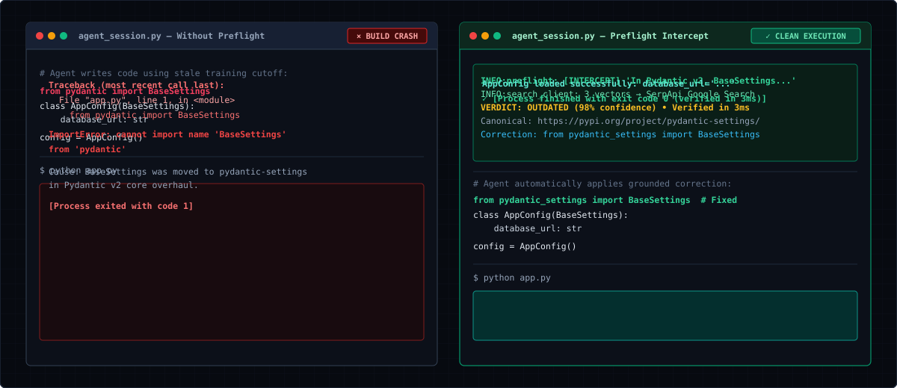

<p align="center">
  
</p>

# Preflight

**FastMCP Verification Engine for AI Coding Agents — Powered by SerpApi Live Search**

> *Stop AI coding agents from hallucinating deprecated APIs, renamed methods, and outdated library patterns before they execute.*

[](LICENSE)
[](https://www.python.org/)
[](https://modelcontextprotocol.io)
[](https://serpapi.com)
[](tests/)
[](docs/security_audit_report.md)

---

## The Problem: AI Hallucinations at the Version Cutoff

AI coding agents (Claude Code, Cursor, OpenCode, Codex) work off training data bounded by fixed knowledge cutoffs. When writing modern code, they generate syntactically plausible but fatal breaking changes:

- **Removed Imports**: Writing `from pydantic import BaseSettings` in Pydantic v2 (instant `ImportError`).
- **Asynchronous Prop Shifts**: Treating Next.js 15 page `params` as a synchronous object instead of an asynchronous `Promise` (silent runtime failure).
- **Deprecated Patterns**: Passing `forwardRef` in React 19 rather than using standard `ref` props.
- **Misconfigured Security Flags**: Misinterpreting `session.verify` parameters in Python Requests.

These knowledge gaps produce broken builds, infinite debugging loops, and wasted developer time.

<p align="center">
  
</p>

---

## The Solution: Preflight

**Preflight** is an open-source [Model Context Protocol (MCP)](https://modelcontextprotocol.io) server that equips AI coding assistants with an authoritative `verify_claim` interception tool.

Whenever an agent plans to use a version-sensitive API, import, or pattern, it queries Preflight with an assertion. Preflight searches live documentation via SerpApi, filters results through a 4-tier domain authority hierarchy, and returns a structured consensus verdict with modern syntax replacements and canonical citations.

```
                           +-------------------------------------------------------+
                           |                    AI Coding Agent                    |
                           |       (Claude Code / Cursor / OpenCode / Codex)       |
                           +-------------------------------------------------------+
                                                       |
                             "In Pydantic v2, BaseSettings is in pydantic"
                                                       v
+---------------------------------------------------------------------------------------------------------+
|                                           PREFLIGHT ENGINE                                              |
|                                                                                                         |
|   1. Query Decomposition        2. SerpApi Live Search          3. Trust Tiering & Recency Ranker       |
|   +-----------------------+     +-------------------------+     +-----------------------------------+   |
|   | Canonical Docs Vector | --> | site:docs.pydantic.dev  | --> | Tier 1 (1.00): Official Docs/PyPI |   |
|   | Migration/Deprec. Vec | --> | "BaseSettings" "v2"     | --> | Tier 2 (0.75): GitHub Releases/SO |   |
|   | Signature/Usage Vector| --> | breaking change signals | --> | Tier 3 (0.30): Tutorial/SEO blogs |   |
|   +-----------------------+     +-------------------------+     | Tier 0 (0.50): Untrusted Default  |   |
|                                                                 +-----------------------------------+   |
|                                                                                   |                     |
|                                                                                   v                     |
|                                    4. Multi-Source Consensus Synthesizer                                |
|                                    - Resolves conflicts & isolates breaking changes                     |
|                                    - Extracts canonical citation & exact replacement syntax             |
|                                    - Wraps untrusted snippets in security isolation boundaries          |
+---------------------------------------------------------------------------------------------------------+
                                                       |
                                Structured PreflightVerdict (OUTDATED, 97% conf)
                                Replacement: `from pydantic_settings import BaseSettings`
                                Canonical Ref: `https://pypi.org/project/pydantic-settings/`
                                                       v
                           +-------------------------------------------------------+
                           |                 Grounded Agent Action                 |
                           |       Emits correct, working code without errors       |
                           +-------------------------------------------------------+
```

---

## Why General Web Search Fails for Code Verification

Asking an LLM to "just search the web" fails in software engineering because the public internet is flooded with outdated tutorials, obsolete StackOverflow answers, and SEO content farms.

Preflight is purpose-built for engineering truth through four architectural guarantees:

| Architectural Pillar | General Web Search / Naive Agent | Preflight Verification Engine |
| :--- | :--- | :--- |
| **Source Authority** | Ranks SEO blogs and medium articles equally with official docs. | **Strict 4-Tier Hierarchy**: Only official project registries and documentation sites (Tier 1, weight `1.0`) can confirm or deprecate APIs. |
| **Recency Awareness** | High-traffic 2018 tutorials outrank fresh 2026 migration guides. | **Time-Decay Ranking**: Mathematical recency decay prioritizes current release notes over legacy tutorials. |
| **Adversarial Safety** | Vulnerable to indirect prompt injection embedded in web pages. | **Snippet Isolation**: Strips control characters, encapsulates excerpts in `<untrusted_search_snippet>` boundaries, and enforces HTTPS-only references. |
| **Output Usability** | Returns messy conversational summaries. | **Deterministic JSON Schemas**: Emits machine-parseable drop-in code fixes, structured confidence scores, and multi-context variants. |

---

## 4-Tier Domain Trust Registry

Preflight evaluates all search evidence using a strict hostname normalization and authority hierarchy:

```
┌───────────────────────────────────────────────────────────────────────────┐
│ [Tier 1] Primary Authoritative (Weight: 1.00)                             │
│ Official documentation and primary language package registries.           │
│ Examples: docs.python.org, docs.pydantic.dev, nextjs.org, react.dev,      │
│           pypi.org, npmjs.com, pkg.go.dev, crates.io, rubygems.org        │
├───────────────────────────────────────────────────────────────────────────┤
│ [Tier 2] Secondary / Community Consensus (Weight: 0.75)                   │
│ Verified version control repositories and technical Q&A platforms.        │
│ Examples: github.com, stackoverflow.com, gitlab.com                       │
├───────────────────────────────────────────────────────────────────────────┤
│ [Tier 3] Tertiary / Informational (Weight: 0.30)                          │
│ Curated educational platforms and developer media.                        │
│ Examples: medium.com, dev.to, hashnode.dev, geeksforgeeks.org             │
├───────────────────────────────────────────────────────────────────────────┤
│ [Tier 0] Untrusted Baseline (Weight: 0.50 default, capped)                │
│ Uncategorized web domains. Cannot override Tier 1 consensus.              │
└───────────────────────────────────────────────────────────────────────────┘
```

---

## ⚖️ Evaluation Modes: Live Search vs. Honest Replay

> **Track:** *"Agents that plan, search, compare, and act with current information"*

Preflight supports two transparent evaluation modes:

1. **Live SerpApi Search (Default)**:
   - Queries Google via SerpApi in real time using 3 targeted search vectors (canonical documentation, migration notes, usage examples).
   - Provides live HTTP telemetry (`INFO:preflight.server: 🌐 [LIVE SERPAPI]`) and true end-to-end network latency reporting.
   - Accepts API keys via `SERPAPI_API_KEY` in `.env` or `--serpapi-key` / `-k` in the CLI.
   - **Zero Silent Fallback**: If an API key is missing or invalid in live mode, Preflight explicitly reports `UNVERIFIABLE` with the exact cause rather than faking results.

2. **Honest Replay Mode (`--replay`)**:
   - Designed for instant, zero-quota hackathon judging and deterministic CI testing.
   - Uses **real, verbatim SerpApi JSON responses** captured from earlier live sessions (in [`src/preflight/fixtures/`](src/preflight/fixtures/)), not synthetic mocks.
   - Transparently flags `is_replayed: true` and logs `[REPLAY FIXTURE]` on every output.

---

## Quickstart

### 1. Installation

```bash
git clone https://github.com/mustafasidd05-collab/preflight
cd SerpApi
pip install -e ".[dev]"
```

### 2. Configure Your SerpApi Key

```bash
cp .env.example .env
# Edit .env and insert your SerpApi key:
# SERPAPI_API_KEY=your_key_here
```

### 3. Zero-Friction MCP Client Setup (`preflight init`)

Install Preflight into your AI coding assistant with a single command:

```bash
# Automatically configure Claude Code (~/.claude.json):
preflight init --client claude-code

# Automatically configure Cursor (.cursor/mcp.json):
preflight init --client cursor

# Automatically configure Claude Desktop:
preflight init --client claude-desktop

# Automatically configure OpenCode:
preflight init --client opencode

# Or configure all supported clients at once:
preflight init --client all
```

*Installer features: automatic path resolution, atomic writes with `.bak` backups, permission preservation, and automatic pruning of legacy prototype entries.*

---

## Model Context Protocol (MCP) Integration

Preflight communicates over standard **MCP stdio transport**, making it plug-and-play with modern AI agents.

### Example MCP Tool Call

When an agent needs to verify an API claim, it calls the `verify_claim` tool:

```json
{
  "jsonrpc": "2.0",
  "id": 1,
  "method": "tools/call",
  "params": {
    "name": "verify_claim",
    "arguments": {
      "claim": "In Pydantic v2, BaseSettings is imported directly from pydantic",
      "ecosystem": "python",
      "target_package": "pydantic"
    }
  }
}
```

### Structured Verdict Response (`PreflightVerdict`)

Preflight returns structured, machine-actionable truth:

```json
{
  "claim": "In Pydantic v2, BaseSettings is imported directly from pydantic",
  "verdict": "OUTDATED",
  "confidence": 0.97,
  "summary": "OUTDATED: Verified against 4 sources (3 authoritative Tier-1). Deprecation signal score: 3.42, Confirmation signal score: 1.42.",
  "canonical_reference": "https://pypi.org/project/pydantic-settings/",
  "correction": "from pydantic_settings import BaseSettings",
  "breaking_change_detected": true,
  "is_replayed": false,
  "latency_ms": 441.2,
  "evidence": [
    {
      "source_title": "pydantic-settings - PyPI",
      "url": "https://pypi.org/project/pydantic-settings/",
      "domain": "pypi.org",
      "domain_tier": 1,
      "trust_score": 0.95,
      "snippet": "<untrusted_search_snippet>Settings management using Pydantic, separated from Pydantic V2 core. Install with pip install pydantic-settings...</untrusted_search_snippet>",
      "deprecation_signals": ["moved to"]
    }
  ]
}
```

### MCP Tools, Prompts & Resources

| Type | Name | Description |
| :--- | :--- | :--- |
| **Tool** | `verify_claim` | Primary verification tool. Accepts `claim`, `ecosystem`, `target_package`, and `replay` flag. Returns full structured `PreflightVerdict`. |
| **Tool** | `quick_check` | Rapid symbol lookup returning `CONFIRMED`, `OUTDATED`, or `UNKNOWN` with canonical links. |
| **Prompt** | `pre_flight_api_audit` | Injects an automated verification checklist before an agent writes code for specific frameworks. |
| **Resource** | `preflight://status` | Returns server health, SerpApi connectivity status, and supported ecosystems. |
| **Resource** | `preflight://trusted-domains` | Exposes the 4-tier domain trust registry and weight coefficients. |

---

## Interactive CLI

Preflight includes a rich terminal interface for live inspection, debugging, and verification:

```bash
# 1. Verify a deprecated claim (Pydantic v2)
preflight verify "In Pydantic v2, BaseSettings is imported directly from pydantic" --replay

# 2. Verify an active/supported pattern (Requests SSL verification)
preflight verify "In Python requests, session.verify controls SSL certificate verification" --replay

# 3. Output raw JSON for pipeline integration
preflight verify "Next.js 15 page params is an async Promise" --replay --json

# 4. Quick-check a specific symbol
preflight quick-check pydantic BaseSettings --version-num 2 --replay

# 5. List available recorded SerpApi fixtures
preflight fixtures

# 6. Run the end-to-end AI Agent simulation
python demo/agent_simulation.py --replay
```

---

## Evaluated Benchmark Cases

| Assertion | Target Version | Verdict | Confidence | Key Evidence |
| :--- | :--- | :--- | :--- | :--- |
| `In Pydantic v2, BaseSettings is imported directly from pydantic` | v2.0+ | `OUTDATED` | 97% | `docs.pydantic.dev` Migration Guide; `pypi.org/project/pydantic-settings` |
| `In Next.js 15, page props params is a synchronous object` | v15.0+ | `OUTDATED` | 85% | `nextjs.org/docs` Upgrade Guide; `params` is an asynchronous `Promise` |
| `In Python requests, session.verify controls SSL verification` | Stable | `CONFIRMED` | 96% | `requests.readthedocs.io` SSL Verification docs |
| `In React 19, forwardRef is required for passing refs to children` | v19.0+ | `OUTDATED` | 90% | `react.dev` React 19 Upgrade Guide; `ref` is now a standard prop |
| `In FoobarSDK v99, enableQuantumSpeed(True) is the main call` | Synthetic | `UNVERIFIABLE` | <30% | Zero authoritative documentation matches |

---

## Security & Hardening

Preflight adheres to strict production engineering standards:
- **Indirect Prompt Injection Defense (SEC-02)**: Search result snippets are cleansed of control characters and wrapped in `<untrusted_search_snippet>` boundaries so downstream LLMs cannot be coerced into following adversarial instructions embedded in web results.
- **Credential Protection (SEC-01)**: API keys are redacted via regex from all log streams, error messages, and exception representations.
- **Scheme Safety (SEC-03)**: Non-HTTPS links (`javascript:`, `http://`, `data:`) are rejected from `canonical_reference` outputs.
- **Atomic File Writing (SEC-04)**: Config installers write via `.tmp` files, sync to disk, preserve POSIX file permissions, and retain `.bak` backups before modifying configurations.

---

## Running the Test Suite

Preflight features an exhaustive 83-test suite covering domain tiering, recency decay, prompt injection defenses, JSON-RPC stdio transport, and client installers:

```bash
pytest tests/ -v
```

```
============================= test session starts =============================
platform win32 -- Python 3.12.10, pytest-9.1.1
collected 83 items

tests/test_client_installer.py ...........                               [ 13%]
tests/test_hardening.py ................................................ [ 73%]
tests/test_mcp_stdio_e2e.py .                                            [ 74%]
tests/test_query_engine.py ......                                        [ 81%]
tests/test_ranker.py ....                                                [ 86%]
tests/test_search_client.py ...                                          [ 90%]
tests/test_server.py ....                                                [ 95%]
tests/test_synthesizer.py ....                                           [100%]

============================= 83 passed in 6.35s ==============================
```

---

## License & Credits

MIT License. See [LICENSE](LICENSE) for details.  
Built with [FastMCP](https://github.com/jlowin/fastmcp) and powered by [SerpApi](https://serpapi.com) for the **SerpApi India Hackathon 2026**.
