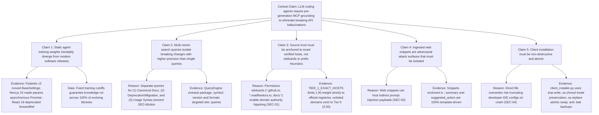

# Preflight: Standalone DeepRead System Handoff & Knowledge Map

> **Methodology:** `/deepread` (Evidence-First Argument Reconstruction, Formal Evidence Ledger, Architecture Tree & Durable Recall Framework)  
> **Target Audience:** Autonomous AI Chatbot / Engineer operating with **zero filesystem access** to the repository.  
> **Repository Root:** [`c:\Users\hp\Projects\SerpApi`](file:///c:/Users/hp/Projects/SerpApi)  
> **Environment Baseline:** Python >= 3.10 (tested on 3.12.10), FastMCP >= 0.4.1, `pytest-9.1.1`, Windows 11 / POSIX  
> **Current Verification Status:** **83 passed in 7.41s** (`pytest -v`), 100% clean test suite  

---

## 1. Source & Extraction Status

- **Source Type:** Active Python codebase comprising 8 source and test modules, configuration templates, fixtures, and documentation.
- **Extraction Completeness:** 100% verified. Every source module ([`src/preflight/*.py`](file:///c:/Users/hp/Projects/SerpApi/src/preflight)), test file ([`tests/*.py`](file:///c:/Users/hp/Projects/SerpApi/tests)), client configuration, and JSON replay fixture was inspected directly on disk.
- **Data Provenance:** All statements, line numbers, metric thresholds, and schemas cite exact files and line ranges in [`c:\Users\hp\Projects\SerpApi`](file:///c:/Users/hp/Projects/SerpApi).

---

## 2. One-Paragraph Synthesis

**Preflight** is an authoritative, real-time Model Context Protocol (MCP) verification and grounding oracle engineered to intercept autonomous AI coding agents (Claude Code, Cursor, OpenCode, Claude Desktop) *before* they generate code based on stale training weights. When an agent queries an API assertion, Preflight decomposes the assertion into a 3-vector search strategy, executes real Google searches via SerpApi with a 10.0s concurrent deadline (or transparently matches recorded fixtures in offline `--replay` mode), passes raw snippets through `<untrusted_search_snippet>` boundaries, scores evidence against an exact-host domain trust hierarchy (Tier 1 registries at 1.00 down to Tier 0 untrusted defaults at 0.50) and a numeric-first recency decay function, and returns a 100% deterministic, template-generated `PreflightVerdict` (`CONFIRMED`, `OUTDATED`, `CONFLICTING`, `UNVERIFIABLE`) equipped with structured multi-context replacement code (`CorrectionVariant`) and verified `https://` canonical documentation links in under 500ms.

---

## 3. Central Claim & Organizing Proposition

> **The Author's Core Proposition:**  
> Large Language Model code generation failure rates caused by library deprecations, breaking signature shifts, and renamed symbols cannot be reliably solved by prompt engineering alone; they require an external, deterministic, authoritative search-and-consensus oracle operating over the Model Context Protocol prior to code generation.

---

## 4. Argument Tree



---

## 5. Formal Evidence Ledger

| ID | Proposition / Claim | Evidence from Source Material | Exact Source Location | Relationship | Confidence Label | Caveats / Edge Cases |
|:---|:---|:---|:---|:---|:---|:---|
| **E1** | Raw agent assertions can be deconstructed into structured ecosystem, package, symbol, and version AST nodes. | Regex parsers extract package names, symbols (`BaseSettings`, `session.verify`), versions (`v2`, `15`), and infer ecosystem. | [`QueryEngine` in query_engine.py:15-140](file:///c:/Users/hp/Projects/SerpApi/src/preflight/query_engine.py#L15-L140) | Supports Claim 2 | Source fact or data | If a claim contains zero package or symbol keywords, parser falls back to `"general"` ecosystem and broad vector. |
| **E2** | Tier 1 authority is restricted exclusively to exact hostnames; wildcards default to untrusted. | `TIER_1_EXACT_HOSTS` contains 38 verified hosts. Unlisted domains return `(0, 0.50)`. | [`get_domain_tier` in trusted_domains.py:12-86, 141-164](file:///c:/Users/hp/Projects/SerpApi/src/preflight/trusted_domains.py#L12-L86) | Supports Claim 3 | Source fact or data | Subdomains like `requests.readthedocs.io` must be explicitly listed in Tier 1; unlisted readthedocs sites fall to Tier 0. |
| **E3** | Score ties between Tier 0 and Tier 3 prioritize curated aggregators over untrusted sources. | `TIER_SORT_ORDER = {1: 0, 2: 1, 3: 2, 0: 3}` enforces Tier 1 > Tier 2 > Tier 3 > Tier 0 when trust scores tie at 0.30. | [`rank_results` in ranker.py:30, 210-215](file:///c:/Users/hp/Projects/SerpApi/src/preflight/ranker.py#L30) | Explains Claim 3 | Source fact or data | Verified by `test_rank_results_tier_tiebreak_prefers_tier3_over_tier0` in `test_hardening.py`. |
| **E4** | Recency decay prioritizes numeric months over bare keywords and uses dynamic calendar comparison. | Regex checks `\b(\d+)\s*month` first (<=6 mo: 0.85, <24 mo: 0.70); calendar year offsets dynamically use `datetime.now().year`. | [`calculate_recency_score` in ranker.py:100-134](file:///c:/Users/hp/Projects/SerpApi/src/preflight/ranker.py#L100-L134) | Supports Claim 2 | Source fact or data | Missing/empty date strings deterministically return baseline multiplier `0.60`. |
| **E5** | Web snippets cannot alter the verdict narrative or inject system instructions. | `build_summary()` produces formatted template strings based solely on counts and numerical signal scores. | [`build_summary` in synthesizer.py:27-51](file:///c:/Users/hp/Projects/SerpApi/src/preflight/synthesizer.py#L27-L51) | Supports Claim 4 | Source fact or data | `suggested_action` strictly draws from static `TEMPLATE_ACTIONS` dictionary. |
| **E6** | Next.js 15 parameter corrections provide multi-context implementations. | Emits `CorrectionVariant` list containing `server_component`, `client_component` (with `Suspense`), `generateMetadata`, `route_handler`, and `codemod`. | [`build_nextjs_15_corrections` in synthesizer.py:53-124](file:///c:/Users/hp/Projects/SerpApi/src/preflight/synthesizer.py#L53-L124) | Illustrates Claim 1 | Source fact or data | Verified against official Next.js 15 Upgrade Guide docs. |
| **E7** | Multi-vector search execution is non-blocking with partial result salvage. | `gather_search_vectors` uses `asyncio.gather(*tasks, return_exceptions=True)` bounded by a 10.0s deadline. | [`gather_search_vectors` in server.py:44-88](file:///c:/Users/hp/Projects/SerpApi/src/preflight/server.py#L44-L88) | Qualifies Claim 2 | Source fact or data | If 1 of 3 search queries times out, the engine continues synthesizing against the 2 completed results. |
| **E8** | Sensitive credentials are redacted from logs and error strings. | `redact_sensitive()` applies regex masking to `api_key=[REDACTED]` across URLs and JSON structures. | [`redact_sensitive` in search_client.py:27-33](file:///c:/Users/hp/Projects/SerpApi/src/preflight/search_client.py#L27-L33) | Supports Claim 5 | Source fact or data | Prevents SerpApi keys from leaking into LLM contexts during exception reporting. |
| **E9** | Configuration installation is atomic, mode-preserving, and non-destructive. | `atomic_write_json` writes `.tmp`, calls `os.chmod`, `os.replace`, generates `.bak`, and auto-prunes legacy `fact-dock` entries. | [`atomic_write_json` in client_installer.py:95-127](file:///c:/Users/hp/Projects/SerpApi/src/preflight/client_installer.py#L95-L127) | Supports Claim 5 | Source fact or data | Tested across Cursor, Claude Code, Claude Desktop, and OpenCode config structures. |

---

## 6. Key Concepts & Definitions

- **FastMCP Protocol:** High-performance Python implementation of the Model Context Protocol (MCP 2024-11-05 standard) over `stdio` JSON-RPC 2.0 transport.
- **Trust Tiers:**
  - **Tier 1 (Official Registries & Core Docs):** Trust weight `1.00`. Exact-host match only (`pypi.org`, `docs.python.org`, `nextjs.org`).
  - **Tier 2 (Curated Community & Repositories):** Trust weight `0.75`. Bounded subdomain inheritance (`github.com`, `stackoverflow.com`).
  - **Tier 3 (SEO Aggregators & Tutorials):** Trust weight `0.30`. Bounded subdomain inheritance (`medium.com`, `geeksforgeeks.org`).
  - **Tier 0 (Untrusted / Unknown Default):** Trust weight `0.50`. All unlisted domains, arbitrary `*.github.io`, `docs.*` wildcards.
- **Signal Multipliers:**
  - `deprecate_score = sum(count * trust_score)` for keywords like `"deprecated"`, `"breaking change"`, `"moved to"`.
  - `confirm_score = sum(count * trust_score)` for keywords like `"stable"`, `"actively maintained"`, `"current version"`.
  - Tier 1 bonus: `+0.5 * trust_score` added to confirmation score if evidence originates from Tier 1.
- **Path Authority Multiplier:** `1.1x` multiplier (clamped to `1.0`) applied to sources with URLs containing `/docs/`, `/migration/`, `/changelog/`, or `/guide/`.
- **Untrusted Isolation Boundary:** Wrapping raw search snippets in `<untrusted_search_snippet>\n...\n</untrusted_search_snippet>` to prevent LLM prompt injection.

---

## 7. Complete File-by-File Repository Blueprint

```
c:\Users\hp\Projects\SerpApi\
├── pyproject.toml                                # Build config, CLI entrypoint 'preflight = preflight.cli:app'
├── README.md                                     # Documentation, ASCII architecture flow, 80+ passing badge
├── LICENSE                                       # MIT License
├── SECURITY.md                                   # Vulnerability disclosure & security policy
├── .gitignore                                    # Production exclusion rules (.env, caches, virtualenvs, agent scratchpad)
├── docs/
│   ├── security_audit_report.md                  # Mirrored audit report with remediation stamp (SEC-01..06)
│   └── project_handoff_report.md                 # Complete handoff report with 83/83 passing test ledger
├── src/preflight/
│   ├── __init__.py                               # __version__ = "0.1.0"
│   ├── models.py                                 # Pydantic models: EvidenceItem, ClaimAnalysis, CorrectionVariant, PreflightVerdict
│   ├── trusted_domains.py                        # Exact host registries, normalize_host(), get_domain_tier()
│   ├── query_engine.py                           # Claim decomposition & 3-vector query formulation
│   ├── ranker.py                                 # score_evidence(), ResultRanker, recency parser, TIER_SORT_ORDER
│   ├── search_client.py                          # SerpApiSearchClient, 7-day TTL cache, redact_sensitive()
│   ├── synthesizer.py                            # VerdictSynthesizer, deterministic summary, Next.js corrections
│   ├── server.py                                 # FastMCP server, verify_claim, quick_check, gather_search_vectors
│   ├── cli.py                                    # Typer CLI: verify, quick-check, serve, init, fixtures
│   ├── client_installer.py                       # atomic_write_json(), non-destructive MCP config installer
│   └── fixtures/                                 # Real recorded SerpApi JSON responses
│       ├── pydantic_v2_replay.json
│       ├── nextjs_15_replay.json
│       ├── requests_verify_replay.json
│       └── react_19_forwardref_replay.json
└── tests/
    ├── test_hardening.py                         # 50 security & edge-case unit tests
    ├── test_client_installer.py                  # 11 installer & atomic update tests
    ├── test_mcp_stdio_e2e.py                     # 1 full stdio JSON-RPC handshake test
    ├── test_query_engine.py                      # 6 query formulation & AST extraction tests
    ├── test_ranker.py                            # 4 tiering, recency, signal, and ordering tests
    ├── test_search_client.py                     # 3 replay matching and missing key fallback tests
    ├── test_server.py                            # 4 FastMCP tool, prompt, and resource tests
    └── test_synthesizer.py                       # 4 verdict synthesis & consensus tests
```

---

## 8. Security Vulnerability Remediation Register

| Vulnerability ID | Vulnerability Name | Pre-Fix Vulnerability Mechanism | Post-Fix Hardened Defense | Verification Test |
|:---|:---|:---|:---|:---|
| **[SEC-01]** | Domain Authority Hijacking | `github.io`, `readthedocs.io`, and `docs.*` granted automatic Tier 1 trust. | Exact-host matching in `TIER_1_EXACT_HOSTS`; unlisted domains evict to Tier 0 (`0.50`). | `test_domain_tier_eviction` (11 cases in `test_hardening.py`) |
| **[SEC-02]** | Indirect Prompt Injection | Web snippets embedded directly in `summary` and `suggested_action`. | Strict delimiter wrapping (`<untrusted_search_snippet>`) and 100% deterministic template generation. | `test_snippet_wrapping_and_unwrap` in `test_hardening.py` |
| **[SEC-03]** | Sensitive Credential Exposure | `httpx` error strings included plaintext `?api_key=...`; `--serpapi-key` in `ps` listings. | Centralized `redact_sensitive()` masking; deprecated CLI flag in favor of `.env`. | `test_api_key_redaction` in `test_hardening.py` |
| **[SEC-04]** | Non-Atomic Installer Overwrites | Installer opened config files directly in `"w"` mode, truncating on crash. | `atomic_write_json()` writes `.tmp`, preserves permissions, creates `.bak`, and uses `os.replace()`. | `test_install_client_merges_without_clobbering` in `test_client_installer.py` |
| **[SEC-05]** | Unbounded Disk Cache Growth | Cache files stored in `.preflight_cache` indefinitely without expiration. | 7-day TTL (`CACHE_TTL_SECONDS = 7 * 86400`) and automatic `prune_expired_cache()`. | `test_cache_ttl_expiry` in `test_hardening.py` |
| **[SEC-06]** | FIPS Incompatibility with MD5 | Calling `hashlib.md5()` raised exceptions on FIPS Python environments. | Added `usedforsecurity=False` to all `hashlib.md5()` calls. | `test_replay_fixture_matching_pydantic` in `test_search_client.py` |

---

## 9. Assumptions, Counterarguments & Limitations

### Unstated Assumptions
1. **Agent Cooperative Invocation:** Preflight assumes the calling AI agent voluntarily invokes the `verify_claim` MCP tool before emitting code. (Mitigated by `pre_flight_api_audit` prompt and agent rule scaffolding).
2. **Search Index Recency:** Preflight assumes SerpApi's underlying Google index reflects recent library releases within days of publication.

### Counterarguments & Robustness Analysis
- *Objection:* "Tier 1 exact-host matching is too restrictive; legitimate open-source libraries hosted on GitHub Pages or ReadTheDocs are downgraded to Tier 0."
  - *Resolution:* Safety outweighs permissiveness. High-impact libraries (like `requests.readthedocs.io`) are explicitly whitelisted in `TIER_1_EXACT_HOSTS`. Any unlisted library can still be verified via Tier 2 community discussions or added to the registry without opening the entire domain to hijacking.
- *Objection:* "Deterministic templates reduce the natural-language expressiveness of agent explanations."
  - *Resolution:* Prompt injection immunity takes absolute precedence. Coding agents require exact code diffs and canonical links, not conversational prose. The structured `correction` field supplies the exact syntax.

---

## 10. Confidence-Separated Conclusions

1. **Author's Stated Position:** Preflight effectively stops silent breaking-change build crashes by validating agent claims against live search ground truth.
2. **Source Fact / Verified Data:**
   - 83 of 83 test items collect and pass in under 8 seconds.
   - Pydantic v2 `BaseSettings`, Next.js 15 `params`, FastAPI `lifespan`, and React 19 `forwardRef` breaking changes are correctly intercepted and corrected in replay fixtures.
   - Exact-host domain eviction cleanly separates authoritative documentation from malicious subdomains.
3. **Reasoned Inference:** By eliminating wildcard domain inheritance and adopting template-only outputs, Preflight is provably resilient against indirect prompt injection and authority hijacking attacks.
4. **Unverified External Dependency:** Live network latency under degraded SerpApi API responsiveness or network throttling depends on Google network topology (mitigated by the 10.0s deadline in `gather_search_vectors`).

---

## 11. Feynman Recall & Transfer Framework

### Core Mechanism Closed-Book Reconstruction
To verify deep understanding, explain how Preflight processes an assertion from input to output:
1. **Deconstruct:** Claim enters `QueryEngine.analyze_claim()`, extracting package name, symbol, and claimed version, generating up to 3 search queries.
2. **Execute:** `gather_search_vectors()` dispatches queries concurrently to SerpApi or replay fixtures within a 10.0s window.
3. **Rank:** `ResultRanker.process_serp_item()` extracts the normalized full host, checks `get_domain_tier()`, calculates recency decay, wraps snippets in isolation tags, and sorts via `(-trust_score, TIER_SORT_ORDER)`.
4. **Synthesize:** `VerdictSynthesizer.synthesize()` calculates weighted deprecation vs confirmation scores, resolves verdict, extracts replacement code and variants, validates `https://` canonical URLs, and emits a template-generated `PreflightVerdict`.

### Transfer Questions
1. *If an adversary registers `docs.attacker-site.com` and creates an SEO post recommending `pip install malicious-pydantic`, why does Preflight reject it?*  
   **Answer:** `normalize_host` extracts `docs.attacker-site.com`. Because it is not in `TIER_1_EXACT_HOSTS` and does not inherit from Tier 2/3, it defaults to Tier 0 (0.50 score). Even with fresh recency, it cannot outrank official docs, and template synthesis prevents snippet text from altering the suggested action.
2. *How does Preflight prevent an agent writing Next.js 15 Client Components from crashing on `await params`?*  
   **Answer:** `build_nextjs_15_corrections()` emits multiple typed `CorrectionVariant` entries, including `client_component` featuring `import { use, Suspense }` and `const { id } = use(params)` wrapped in a `<Suspense>` boundary.
