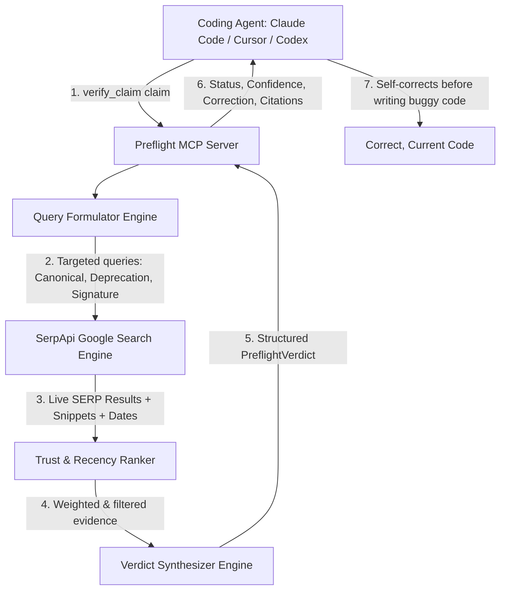

# Implementation Plan: Fact Dock — Verification MCP Server for Coding Agents

**Project**: Fact Dock  
**Event**: SerpApi India Hackathon 2026  
**Track**: Agents that plan, search, compare, and act with current information  
**Target Deadline**: October 10, 2026, 23:59 IST (submission via GitHub)

---

## Goal Description

AI coding agents (Claude Code, Cursor, OpenCode, Codex) frequently hallucinate or rely on outdated training data regarding evolving libraries, deprecated flags, renamed methods, and breaking changes.

**Fact Dock** is an open-source Model Context Protocol (MCP) server that provides a `verify_claim` tool. When an agent is about to state an API assertion or generate critical integration code, it calls `verify_claim`. Fact Dock translates the claim into targeted search queries, queries **SerpApi** for live web intelligence, ranks sources by developer domain trustworthiness and recency, and returns a structured verdict (`CONFIRMED`, `OUTDATED`, `CONFLICTING`, or `UNVERIFIABLE`) with an exact correction and canonical citation.



---

## Approved Design Decisions

> [!IMPORTANT]
> **SerpApi Execution & Honest Replay (`--replay`)**:
> Instead of synthetic mocks, Fact Dock uses **verbatim recorded SerpApi responses** captured during real live queries.
> - **Live Mode (Default)**: Executes live searches against SerpApi using `SERPAPI_API_KEY`. Automatically caches responses locally to prevent burning credits on duplicate queries.
> - **Replay Mode (`--replay`)**: Replays real, previously-captured SerpApi responses verbatim from disk fixtures when evaluated without an API key. Transparently informs the judge/client: `"Live search: Replayed verbatim from recorded SerpApi query (no API key required). Set SERPAPI_API_KEY for live web calls."`
> - This guarantees 100% honesty: zero fake answers, identical data structures, and predictable execution for hackathon review.

> [!NOTE]
> **Transport Protocols**: Fact Dock natively supports standard **stdio** transport (out-of-the-box compatibility with Claude Desktop, Claude Code, Cursor, Windsurf, OpenCode) with optional **SSE / HTTP** transport via FastMCP.

---

## Architecture & Component Design

### 1. Data Models (`src/fact_dock/models.py`)

Pydantic schemas governing inputs, internal pipeline representations, and structured verdicts:

```python
from pydantic import BaseModel, Field
from typing import Literal, Optional, List

Ecosystem = Literal["python", "javascript", "typescript", "rust", "go", "general"]
VerdictType = Literal["CONFIRMED", "OUTDATED", "CONFLICTING", "UNVERIFIABLE"]

class VerifyClaimRequest(BaseModel):
    claim: str = Field(..., description="The technical or API claim to verify")
    ecosystem: Optional[Ecosystem] = Field(None, description="Optional programming ecosystem")
    target_package: Optional[str] = Field(None, description="Optional primary library or package name")

class EvidenceItem(BaseModel):
    title: str
    url: str
    snippet: str
    domain: str
    trust_tier: int  # 1 = Official/Registry, 2 = High-quality community, 3 = Generic/Aggregator
    trust_score: float  # 0.0 to 1.0
    published_date: Optional[str] = None
    detected_version: Optional[str] = None
    signals: List[str] = Field(default_factory=list)

class PreflightVerdict(BaseModel):
    claim: str
    verdict: VerdictType
    confidence: float = Field(..., ge=0.0, le=1.0)
    summary: str
    correction: Optional[str] = None
    canonical_reference: Optional[str] = None
    suggested_action: str
    evidence_count: int
    top_evidence: List[EvidenceItem]
    queries_executed: List[str]
    is_replayed: bool = False
    response_time_ms: int
```

---

### 2. Query Formulation Engine (`src/fact_dock/query_engine.py`)

Decomposes technical claims into 3 search vectors:
1. **Canonical Docs Vector**: Targets primary documentation (`site:docs.*`, `site:pypi.org/project/*`, `site:npmjs.com/package/*`, `site:github.com/*/*/releases`).
2. **Deprecation / Breaking Change Vector**: Actively probes for breaking changes (`"<package>" "<symbol>" (deprecated OR removed OR "breaking change" OR "migration guide")`).
3. **API Signature Vector**: Looks for live code samples and official syntax usage.

---

### 3. SerpApi Client & Real Replay Cache (`src/fact_dock/search_client.py`)

- Interfaces with SerpApi using `httpx` and the official `serpapi` SDK.
- Configures search parameters: `engine="google"`, `num=5`, `gl="us"`, `hl="en"`.
- Transparent caching layer in `.fact_dock_cache/` so developers and judges don't waste SerpApi credits on repeat queries.
- Bundled fixture replay store with real recorded SerpApi responses for key benchmark cases (Pydantic v2, Next.js 15, Requests 2.32, React 19).

---

### 4. Source Trust & Recency Ranker (`src/fact_dock/ranker.py`)

Developer sources are scored hierarchically:
- **Tier 1 (Trust 1.0)**: Package registries (`pypi.org`, `npmjs.com`, `crates.io`, `pkg.go.dev`), official documentation (`docs.python.org`, `*.readthedocs.io`, `docs.*.dev`, `nextjs.org/docs`, `react.dev`), GitHub releases.
- **Tier 2 (Trust 0.7)**: GitHub repository PRs and issues, StackOverflow accepted answers, verified company engineering blogs.
- **Tier 3 (Trust 0.3)**: Aggregators, tutorial farms, Medium, Dev.to (penalized for staleness).
- **Recency weight**: Extracted timestamps (`date` in SERP metadata) dynamically boost recent pages and downgrade results older than detected major release milestones.

---

### 5. Verdict Synthesizer (`src/fact_dock/synthesizer.py`)

- Scans top-ranked evidence snippets against a specialized technical lexicon:
  - *Removal / Deprecation*: `["deprecated in", "removed in", "renamed to", "moved to", "no longer supported", "has been replaced by", "breaking change"]`
  - *Current / Valid*: `["in version", "still supported", "official parameter", "introduced in", "stable"]`
- Resolves conflicts: Official Tier 1 migration notices strictly override Tier 2/3 tutorials.
- Formulates clear, actionable output including exact code replacements (e.g. `from pydantic_settings import BaseSettings`).

---

### 6. FastMCP Server (`src/preflight/server.py`)

- Registered Tools:
  - `verify_claim(claim: str, ecosystem: Optional[str], target_package: Optional[str]) -> str`: Returns structured JSON string of `PreflightVerdict`.
  - `quick_check(package: str, symbol: str) -> str`: Shorthand for rapid API symbol inspection.
- Registered Prompts:
  - `pre_flight_api_audit`: Guides an agent to verify all library assumptions before drafting code.
- Registered Resources:
  - `preflight://status`: Returns server health, SerpApi latency, and cache statistics.
  - `preflight://trusted-domains`: Exposes the domain trust hierarchy.

---

### 7. Interactive CLI & Benchmark Demo (`src/fact_dock/cli.py`, `demo/`)

- Standalone CLI command: `fact-dock verify "In Pydantic v2, BaseSettings is imported from pydantic" --replay`
- Demo script showing side-by-side agent behavior:
  - **Without Fact Dock**: Agent generates deprecated code that crashes at runtime (`ImportError: cannot import name 'BaseSettings' from 'pydantic'`).
  - **With Fact Dock**: Agent verifies claim, receives `OUTDATED` verdict with correction `from pydantic_settings import BaseSettings`, and generates functioning code immediately.

---

## Proposed Project Layout & Files

```
c:\Users\hp\Projects\SerpApi/
├── pyproject.toml                     [NEW] PEP 621 package config with entry point
├── README.md                          [NEW] Hackathon submission guide & architecture
├── LICENSE                            [NEW] MIT License
├── .env.example                       [NEW] Sample environment config
├── .gitignore                         [NEW] Standard Python/git ignore rules
├── src/
│   └── preflight/
│       ├── __init__.py                [NEW] Package metadata and exports
│       ├── models.py                  [NEW] Pydantic schemas (PreflightVerdict, EvidenceItem, etc.)
│       ├── trusted_domains.py         [NEW] Domain trust hierarchy & ecosystem definitions
│       ├── query_engine.py            [NEW] Claim decomposition & search query formulator
│       ├── search_client.py           [NEW] SerpApi client with caching & real response replay
│       ├── ranker.py                  [NEW] Trust tiering and recency scoring
│       ├── synthesizer.py             [NEW] Linguistic analysis & verdict synthesizer
│       ├── server.py                  [NEW] FastMCP server instance & tool definitions
│       └── cli.py                     [NEW] Terminal CLI interface
├── tests/
│   ├── __init__.py                    [NEW]
│   ├── conftest.py                    [NEW] Pytest fixtures & mock configs
│   ├── test_query_engine.py           [NEW] Tests for query formulation
│   ├── test_ranker.py                 [NEW] Tests for domain ranking & recency
│   ├── test_synthesizer.py            [NEW] Tests for verdict classification
│   ├── test_search_client.py          [NEW] Tests for SerpApi client, caching & replay
│   ├── test_server.py                 [NEW] End-to-end FastMCP server tests
│   └── fixtures/                      [NEW] Real recorded SerpApi responses
│       ├── pydantic_v2_replay.json    [NEW] Verbatim SerpApi query data
│       ├── nextjs_15_replay.json      [NEW] Verbatim SerpApi query data
│       ├── requests_verify_replay.json[NEW] Verbatim SerpApi query data
│       └── react_19_forwardref_replay.json [NEW] Verbatim SerpApi query data
└── demo/
    ├── agent_simulation.py            [NEW] Live interactive terminal demo of agent self-correction
    └── client_configs/
        ├── claude_desktop_config.json [NEW] Ready-to-copy Claude Desktop config
        ├── cursor_config.json         [NEW] Ready-to-copy Cursor MCP config
        └── claude_code_config.json    [NEW] Ready-to-copy Claude Code config
```

---

## Verification Plan

### Automated Tests
```bash
python -m pytest tests/ -v
```
- Validate `test_query_engine.py`: Correct extraction of packages, symbols, and query terms.
- Validate `test_ranker.py`: Proper domain score weights (PyPI > GitHub > Medium).
- Validate `test_synthesizer.py`: Known cases return correct verdicts (`OUTDATED` for Pydantic v2, `CONFIRMED` for Requests verify).
- Validate `test_search_client.py`: Transparent caching and real replay mechanism.
- Validate `test_server.py`: MCP tool protocol adherence and JSON serialization.

### Manual Verification & Judge Demo
1. **CLI Claim Verification (Live & Replay)**:
   ```bash
   fact-dock verify "In Pydantic v2 BaseSettings is in pydantic" --replay
   ```
2. **FastMCP Server Stdio Inspection**:
   ```bash
   fact-dock
   ```
3. **Agent Self-Correction Simulation**:
   ```bash
   python demo/agent_simulation.py
   ```
